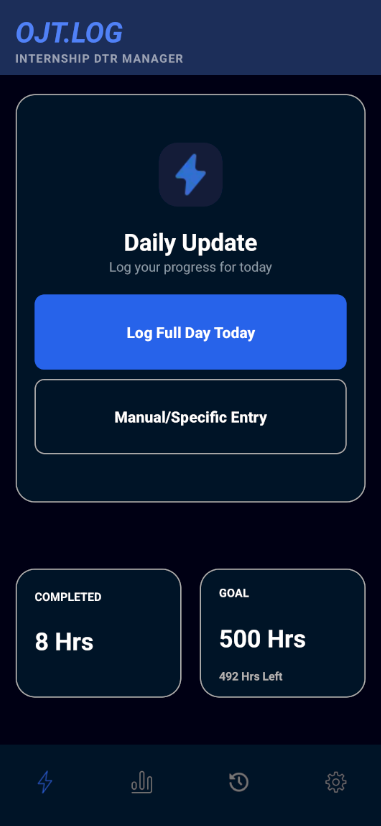
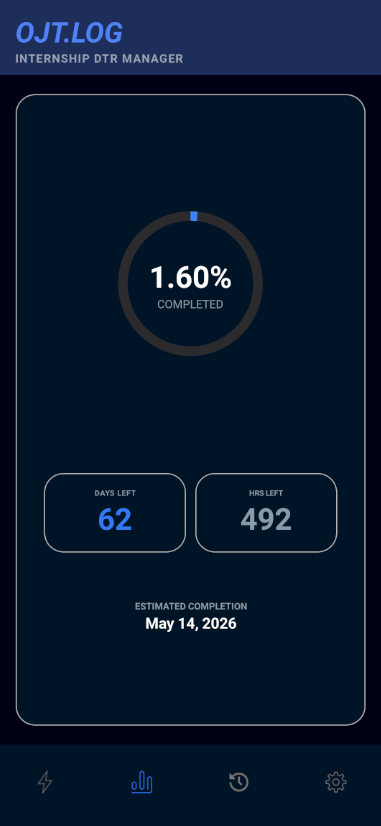
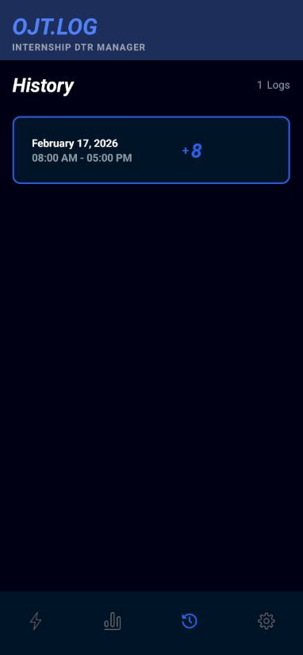
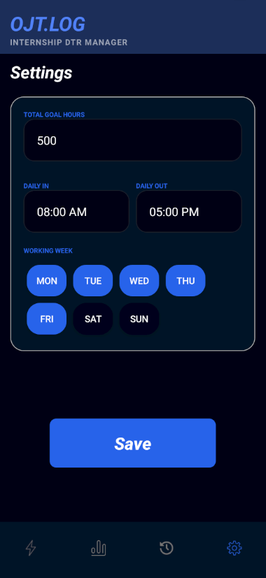

# OJT.Log — Internship DTR Manager

**OJT.Log** is a streamlined Daily Time Record (DTR) tracker designed for interns and trainees.
It removes the friction of manual spreadsheets by automating hour calculations and progress tracking.

---

## FEATURES

### **1. Instant Logging**

The **Main Page** is designed for speed.
**Quick Log** allows you to record a full day's work with a single tap based on your preset schedule.
**Manual Entry** gives you the flexibility to log specific dates, times, absences, or holidays.
The dashboard provides a real-time glance at **Completed Hours** versus your **Total Goal**.

### **2. Progress Analytics**

The **Progress Page** visualizes your journey.
It displays a **Completion Percentage** to show how far you have come.
The app automatically calculates **Days Left** and **Hours Left**.
It provides an **Estimated Completion Date** to help you plan your final day.

### **3. Effortless History**

The **History Page** acts as your digital paper trail.
View every logged entry in a clean, chronological list.
Verify your clock-in and clock-out times at any moment.

### **4. Personalized Settings**

The **Settings Page** makes the app yours.
Define your **Total Goal Hours** (e.g., 500 hours).
Set your standard **Clock-in** and **Clock-out** times.
Select your specific **Working Days** (e.g., Monday to Friday).

---

## TECHNICAL STACK

* **Language:** **Kotlin**
* **Database:** **Firebase**
* **IDE:** **Android Studio**

---

  

  
